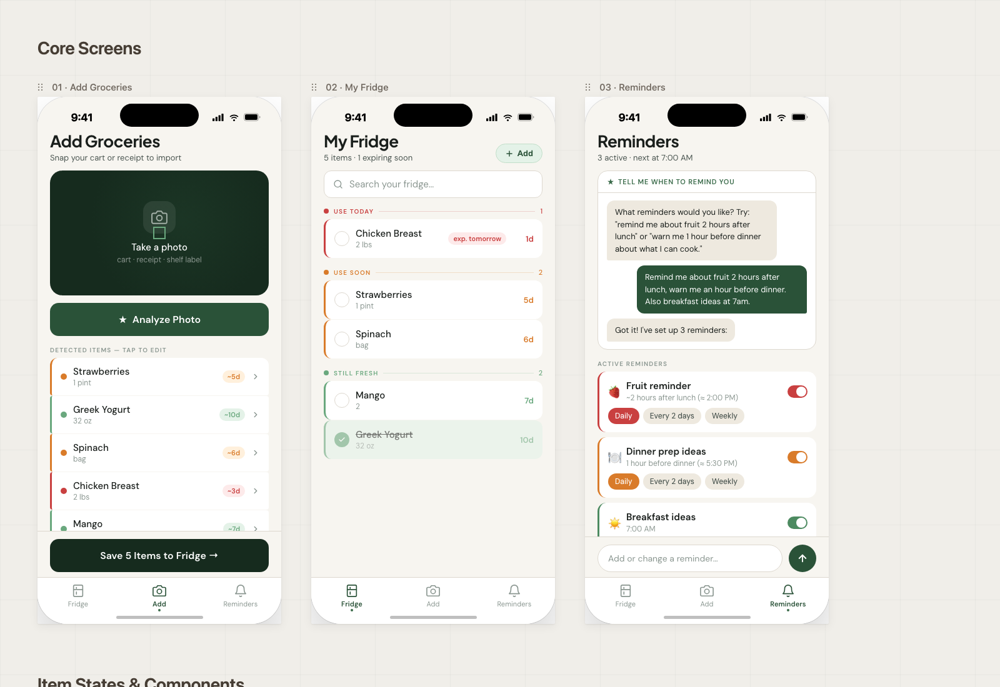

# FreshTrack

Zero-waste grocery tracking. FreshTrack helps you track what's in your fridge, flags items expiring soon, and reduces food waste.

## The Problem

You buy groceries, forget about them, they go bad, get thrown out. Food waste and money waste, on repeat.

Every existing food tracking app has the same fatal flaw: **manual entry**. Adding items one by one (barcode scanning or typing) creates enough friction that users abandon the app within days.

## The Insight

The checkout photo as the onboarding moment. You're already at the store with your cart or receipt in front of you. One photo, LLM vision parses everything, predicted expiry dates pre-filled, you just confirm. **Zero manual entry.**

The real product is time-aware nudging, not inventory management. The fridge tracker is the data layer. The unlock is: instead of expiry alerts ("this expires in 3 days"), you get meal-time reminders ("you have chicken and strawberries — time to plan dinner"). People act on immediacy, not warnings.

The second unlock: plain English reminder preferences. Type "remind me about fruit 2 hours after lunch" and the app produces a structured reminder. No settings screen.

## Success Criteria

- Receipt photo at checkout → ≥80% of items parsed within 30 seconds
- Fruit reminder fires 2 hours after lunch with what's in the fridge
- Consumed items removed from list in one tap
- Zero manual text entry required to track a full grocery run

## Design



## Project Status

**Phase 1a (current):** Real FastAPI + PostgreSQL backend. Register, log in, add/consume/delete items — all persisted in a real database.

## Structure

```
freshtrack/
  backend/         FastAPI backend (Python)
  mobile/          Expo React Native iOS app
  docs/
    screens.jsx    UI reference (design source of truth)
    FreshTrack.html  Design canvas preview
    superpowers/
      specs/       Design specs
      plans/       Implementation plans
```

## Running (Phase 1a)

### 1. Start the backend

Requires: Docker, Python 3.11+

```bash
cd backend

# First time only — set up Python env
python3 -m venv venv
source venv/bin/activate
pip install -r requirements.txt

# Start Postgres
docker compose up -d

# Run migrations
alembic upgrade head

# Start API (http://localhost:8000, Swagger at /docs)
uvicorn app.main:app --reload
```

### 2. Run the mobile app

Requires: Node.js, Expo CLI

```bash
cd mobile
npx expo start
```

Press `i` for iOS simulator (uses `localhost:8000`). For a real device on WiFi, set your laptop's local IP in `mobile/constants/config.ts`.

### Backend Tests

```bash
cd backend
source venv/bin/activate
pytest -v
```

17 tests — auth utilities, register/login endpoints, items CRUD with user isolation.

### Mobile Tests

```bash
cd mobile
npx jest
```

## Tech Stack

### Backend

- Python 3.11+ / FastAPI 0.111
- SQLAlchemy 2 (sync) + Alembic migrations
- PostgreSQL 16 (Docker Compose)
- passlib[bcrypt] + python-jose (JWT, 30-day expiry)
- pytest + httpx TestClient

### Mobile

- Expo SDK + Expo Router (file-based navigation)
- React Native / TypeScript
- expo-secure-store (encrypted JWT storage)
- react-native-svg (icon set)
- @expo-google-fonts/dm-sans + plus-jakarta-sans
- Jest (unit tests for pure logic)

### Design Tokens

Colors, typography, and freshness bucket logic live in `mobile/constants/`. The `T` token palette matches `docs/screens.jsx` exactly.

| Bucket | Days | Color |
|--------|------|-------|
| Use Today | 1–2d | coral `#C94040` |
| Use Soon | 3–6d | amber `#D97B2A` |
| Still Fresh | 7d+ | sage `#6AA87E` |

## Roadmap

- **Phase 0 ✓** Frontend prototype with mock data
- **Phase 1a ✓** Real backend (FastAPI + PostgreSQL) — auth, items CRUD, data persistence
- **Phase 1b (next):** Real camera capture + GPT-4o receipt parsing
- **Phase 2:** Push notification reminders with plain English preference input
- **v2 (future):** Waste coaching — photo your trash at end of week, LLM diffs against what was tracked, learns your actual waste patterns
